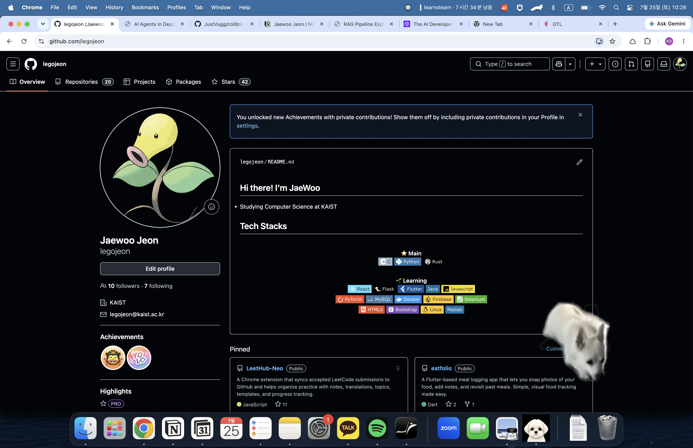
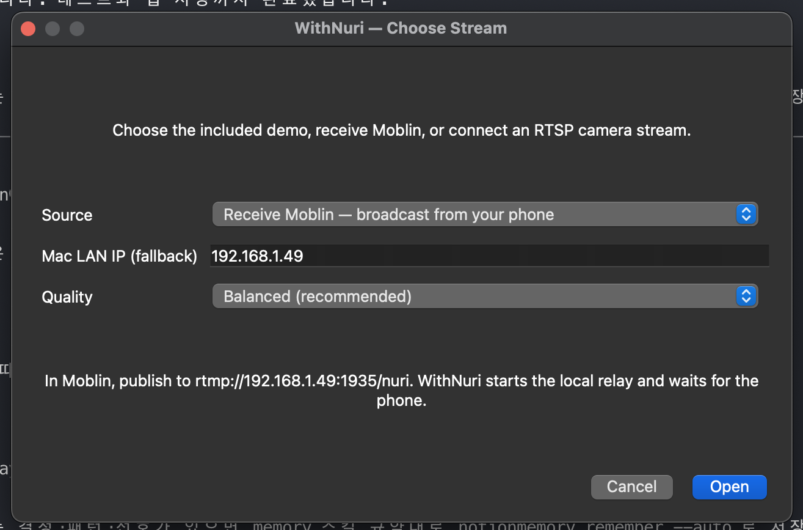
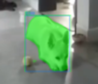

# WithNuri

WithNuri is a desktop prototype that turns a live pet-camera stream into a
transparent, always-on-top pet overlay. It detects dogs and cats with
YOLO11 segmentation, keeps their masks visible through brief detection loss,
and follows them with ByteTrack.

The current goal is a polished local demo. Cloud relay, accounts, and service
hosting are deliberately future work.

## What it does

- Reads RTSP video through ffmpeg.
- Segments and tracks dogs and cats with YOLO11n-seg + ByteTrack.
- Draws a cropped, transparent overlay that can be arranged, resized, hidden,
  or inspected in a debug window from the menu-bar icon.
- Reconnects after a stream interruption without closing the overlay.
- Starts a local MediaMTX relay for the bundled demo or a Moblin phone stream.
- Provides balanced, low-power, and high-quality presets.

The transparent overlay stays above ordinary desktop apps while keeping the
rest of the window clear:

<p align="center">
  
</p>

## Stream architecture

```text
Moblin phone ─RTMP─> MediaMTX relay ─RTSP─> WithNuri ─> transparent pet overlay
```

The app supports three launch profiles:

| Profile | Starts locally | Use it for |
| --- | --- | --- |
| Play local demo | MediaMTX + a looping dog MP4 | Testing the full overlay without a phone. |
| Receive Moblin | MediaMTX only | A phone publishes RTMP directly to this Mac. |
| Connect existing RTSP | Nothing | An existing local, remote, or future hosted relay. |

## Development setup

Requirements: Python 3.11+, ffmpeg/ffprobe on `PATH`, and a supported desktop
environment. On macOS:

```bash
brew install ffmpeg
python3 -m venv .venv
.venv/bin/python -m pip install -e ".[dev,ml,ui]"
```

Start the source picker:

```bash
.venv/bin/python -m withnuri demo
```

For full command-line examples, diagnostics, quality tuning, and Windows
packaging, see [COMMANDS.md](COMMANDS.md).

## Moblin quick start

1. Connect the Mac and phone to the same Wi-Fi/LAN. A phone's personal hotspot
   can prevent phone-to-Mac connections, so ordinary shared Wi-Fi is preferred.
2. Launch `withnuri demo` or the packaged app and choose **Receive Moblin**.

   <p align="center">
     
   </p>

3. Copy the exact address shown in the dialog, for example:

   ```text
   rtmp://192.168.1.49:1935/nuri
   ```

4. In Moblin, either paste the complete URL, or enter the server as
   `rtmp://192.168.1.49:1935` and the stream key as `nuri` when its UI uses
   separate fields.
5. Click **Open** in WithNuri first, then start broadcasting in Moblin.

WithNuri reads the relay internally at `rtsp://127.0.0.1:8554/nuri`; that
localhost address is for the app only, not for the phone.

If the picker cannot detect a usable Mac LAN IP, reconnect both devices to the
same Wi-Fi and reopen the picker. The **Mac LAN IP (fallback)** field exists
only for cases where the correct IPv4 address is already known.

## Local runtime assets

Large or platform-specific files are intentionally not stored in Git. Prepare
them locally before using local-demo mode or building an app bundle.

| Asset | Expected location | Purpose |
| --- | --- | --- |
| MediaMTX binary | `WithNuri-tools/mediamtx/mediamtx` (or `.exe`) | Local RTMP-to-RTSP relay. |
| YOLO model | `yolo11n-seg.pt` | Segmentation and tracking. Ultralytics can fetch it on first online run; keep a local copy for offline packaging. |
| Demo video | `tests/video/dogcam.mp4` | Looping local-demo source and packaged demo video. |
| ffmpeg | On `PATH`, or set `FFMPEG_BIN` for packaging | RTSP decode and bundled demo publisher. |

Download the MediaMTX binary matching the target OS from the
[MediaMTX releases page](https://github.com/bluenviron/mediamtx/releases) and
place it next to the tracked `mediamtx.yml` configuration. Use your own dog MP4
at the expected demo-video path when cloning the repository.

## Direct RTSP overlay

Use an existing stream without opening the picker:

```bash
.venv/bin/python -m withnuri overlay rtsp://127.0.0.1:8554/nuri \
  --width 1280 --height 720 \
  --quality balanced \
  --diagnostics
```

Use the debug view when inspecting segmentation boundaries and tracker IDs:

```bash
.venv/bin/python -m withnuri tracking-debug rtsp://127.0.0.1:8554/nuri \
  --width 1280 --height 720 \
  --display-width 1280 --display-height 720
```

<p align="center">
  
</p>

Quality presets:

| Preset | Inference size / decode rate | Intended use |
| --- | --- | --- |
| `low-power` | 640 / 6 fps | Lower heat and power use. |
| `balanced` | 768 / 8 fps | Default starting point. |
| `high` | 960 / 8 fps | Smaller or more distant pets. |

An explicit option such as `--decode-fps 7` overrides the profile value.

## Package the demo app

The bundled app contains the YOLO model, ffmpeg, MediaMTX, demo video, and
tray icon. It must be built separately for each target operating system.

### macOS (Apple Silicon)

```bash
.venv/bin/python -m pip install -e ".[dev,ml,ui,package]"
bash scripts/build_macos_app.sh
open dist/WithNuri.app
```

The macOS script requires Apple-Silicon MediaMTX and ffmpeg. It creates
`dist/WithNuri.app`.

### Windows

Run this from a Windows checkout after placing `mediamtx.exe`, `dogcam.mp4`,
and `yolo11n-seg.pt` at the locations above, and after making ffmpeg available:

```powershell
.venv\Scripts\python.exe -m pip install -e ".[dev,ml,ui,package]"
$env:FFMPEG_BIN = "C:\tools\ffmpeg\bin\ffmpeg.exe"
powershell -ExecutionPolicy Bypass -File scripts\build_windows_app.ps1
```

The output is `dist\WithNuri\WithNuri.exe`. Always verify always-on-top,
click-through, and tray behavior on a Windows machine before release.

## Repository scope

The repository tracks application source, build scripts, the MediaMTX config,
and packaged icon assets. It intentionally ignores local AI-agent state,
virtual environments, caches, app bundles, model weights, demo video, and
platform-specific relay binaries. This keeps commits reviewable and prevents
large local artifacts from entering Git history.

`tests/` and `docs/` are currently local-only by project policy. Run the local
test suite before changing the application:

```bash
.venv/bin/python -m pytest
.venv/bin/ruff check src tests
```

## Current limitations

- The demo focuses on local/LAN streaming; it is not yet a hosted service.
- Only dog and cat classes are rendered.
- Current macOS packaging targets Apple Silicon.
- The UI can display a fallback IP field when network configuration prevents
  automatic LAN address discovery.

## Follow-up roadmap

- Add a more aggressive adaptive power-saving mode: reduce inference to about
  1 fps when no pet is active or the overlay is hidden, then immediately return
  to the selected quality profile when activity resumes.
- Tune quality profiles automatically against the host machine's observed
  inference and render latency.
- Replace the local relay endpoint with a hosted relay/profile without changing
  the overlay, tracking, or rendering pipeline.
